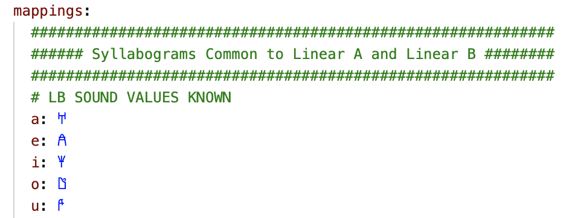
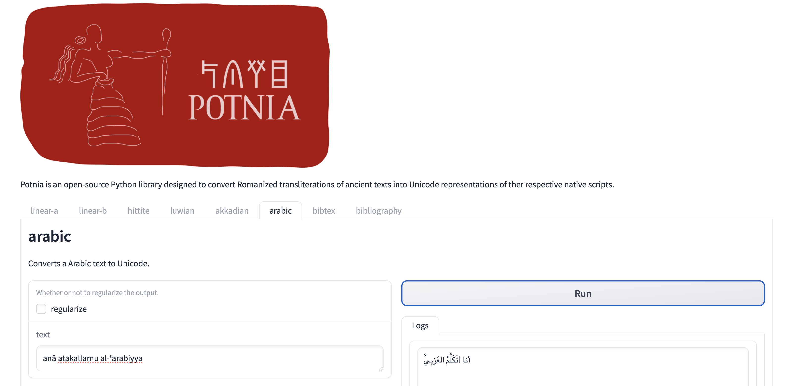

# Summary

Potnia is an open-source Python library designed to convert Romanized transliterations of ancient texts into their respective Unicode representations. Significant progress has been made in the digitization of ancient language corpora. However, many of these datasets are solely presented in transliterated form, even though the necessary Unicode blocks exist to render them using their native script. This restriction to using transliterated datasets for certain ancient scripts has the potential to limit the precision of linguistic analysis via machine learning.

Potnia bridges this gap by providing a flexible framework for converting transliterations into Unicode. By enabling tokenization and processing in the original script, Potnia can optimize tasks such as textual restoration and machine learning-based analysis. The library currently supports:

  - Linear A
  - Linear B
  - Hittite cuneiform
  - Arabic

While Linear B has the most comprehensive test cases and is the most robust, the tool can also be used effectively for the other scripts. The architectural flexibility of Potnia makes it easy to accommodate additional scripts, offering significant value to both computational linguistics and digital humanities by enabling researchers to work with ancient texts in their native scripts.

# Statement of Need

While machine learning has increasingly been applied to the study of ancient texts [@sommerschieldMachineLearningAncient2023], much of this progress has involved working with transliterated texts, rather than native script formats [@luoNeuralDeciphermentMinimumcost2019; @papavassileiouGenerativeModelMycenaean2023; @fetayaRestorationFragmentaryBabylonian2020; @peronocacciafocoNewApproachDecipherment2021]. Although Unicode standards exist for many ancient scripts, transliterated texts remain prevalent due to historical digitization practices.

Transliteration is the process of converting text from its original script into a different script, using systematic processes. It allows those who can understand the secondary script to comprehend the orthography and the approximate pronunciation of the original text. Prior to the gradual introduction of relevant Unicode blocks since the 1990s [@Hossain2024], it was also usually necessary for representing non-Latin scripts on Western computational systems, which were largely confined to letters of the Latin alphabet and a small number of special characters.

Transliteration has an important place in aiding new learners of an ancient script to understand the pronunciation and orthography of the underlying language it represents (particularly for non-alphabetic scripts, where beginners need to grasp a vast repertoire of unfamiliar signs). However, it is well recognized that this process can only provide an approximate, and often unsatisfactory or disputed, representation of the original text [@weinbergTransliterationDocumentation1974; @odishoTransliteratingEnglishArabic1992; @martinetProjectTransliterationClassical1953]. In particular, a lack of standardized approaches to transliteration can introduce considerable ambiguity and noise into the dataset in a variety of ways, including:

  - the use of various notation systems, with different transliterations representing the exact same sign in distinct ways (e.g. where {height="11pt"} in Akkadian cuneiform can be represented as either 'mè' or 'me\textsubscript{3}');
  - changing opinions on particular sign values over time, introducing possible differences between older and newer transliterations (e.g. {height="11pt"} in the Linear B script changing from the previously suggested value of 'pa\textsubscript{2}' to 'qa')[@chadwickDocumentsMycenaeanGreek1973, pp. 389, 391];
  - and the way in which transliteration obscures polyvalency in scripts, where a single sign can represent multiple different values (e.g. {height="11pt"} in Hittite cuneiform can represent three different syllables, transliterated as 'ḫar', 'ḫur' and 'mur', as well as acting as a logogram for three different words, 'ring', 'thick' and 'lung').

For language modelling tasks, we therefore suggest that representations of texts in their native form are preferable to achieve the most accurate results. A number of digitized corpora for well-resourced and widely studied ancient languages are now available in Unicode representations of their native script, including a corpus of ancient Greek [@canonicalgreek], classical Hebrew [@sefaria_project], Syriac [@digital_syriac] and Arabic [@openiti]. However, many other online text corpora remain restricted to Romanized translisterations (despite the availability of relevant Unicode standards), presumably due to considerations around ease, system limitations and accessibility, e.g. Linear B [@auroraDAMOSDatabaseMycenaean2015], Ugaritic [@prosser2019ras] and Sumero-Akkadian cuneiform [@cdli2024]. For this latter group of scripts, current tools capable of converting transliterated ancient texts to the corresponding Unicode appear limited to a handful of individual scripts, such as the various implementations of 'Cuneify' [@tinney2019cuneify] that handle Sumero-Akkadian cuneiform, the PHP script 'UnicodeConverter', for Egyptian hieroglyphs [@ilintomich2021unicodeconverter], or 'Anatolian Hieroglyphics (Luwian) generation' tool for Luwian hieroglyphs [@senior2023anatoliangenerator], the latter only available to use through a basic online graphical user interface. While the PyArabic package [@Zerrouki2023] is able to convert Arabic text to and from the popular Timothy Buckwalter transliteration system, Potnia provides a complementary functionality for the DIN 31635 transliteration system [@DIN31635] which is widely used in academic literature.

In addition, such transliterations of ancient texts are often heavily annotated, with special characters used to denote a range of features including uncertain readings, missing or damaged elements, erasures, non-textual marks, and annotations by modern transliterators pertaining to structural or physical elements of the document. If not removed or handled appropriately, these have the potential to introduce further noise into language models. 

These are the primary gaps we have aimed to address through the development of Potnia. The library's focus on ancient scripts and its extensible architecture make it a valuable asset for researchers working with digitized ancient corpora. It is also equipped to provide specific handling of these elements, with tailored tokenization and regularization rules pertaining to both script-specific and corpus-specific conventions. Potnia therefore enables a key pre-processing step in the language modelling pipeline, with the resulting Unicode outputs of ancient texts enabling more accurate and nuanced computational analysis of these texts in downstream modelling tasks.

# Implementation

Potnia is implemented in Python with an extensible architecture centered around the `Script` class, which converts transliterated texts into Unicode representations. It is designed to handle the complexities of ancient scripts through a flexible and customizable framework.

## Key Features

1. **YAML-Based Mapping and Rule Specification:**
Each script in Potnia (e.g. Linear A, Linear B, Arabic, Hittite cuneiform) is configured via a single YAML file that contains syllabograms, logograms, and rules for transliteration and regularization. This unified structure simplifies updates, scales easily for new scripts, and eliminates the need for hardcoded source files (fig. \ref{fig:mappings}).

{ width=50% }

2. **Tokenization:** The `tokenize_transliteration` method applies complex symbol replacements and regular expressions to transliterated text based on the rules specified in the YAML file. This tokenization process ensures that the text is split accurately into its meaningful components, handling special symbols and spacing using placeholders, and preparing the text for Unicode conversion.

3. **Transliteration to Unicode:** Potnia uses the `__call__` method to convert the transliterated text to its Unicode representation (fig. \ref{fig:potnia-example}).

{ width=80% }

4. **Regularization of Text:** The regularize method applies a series of regular expression rules to clean and normalize the Unicode output. It removes unnecessary tags, ignores patterns specified in the YAML file (e.g. annotations or uncertain characters), and ensures that only the essential characters are retained. This step ensures the output is refined and ready for downstream tasks.

5. **Comprehensive Testing:** Pytest fixtures allow us to define test cases as lines in YAML files which allowed us to consisely add over 360 test examples, covering a broad range of edge cases. The code coverage of the tests is 100%.

6. **Versatile Interface Options** Users can interact with Potnia as a Python library, or through the command line interface (CLI), or through the graphical user interface (GUI) (fig. \ref{fig:potnia-gui})

{ width=80% }

# Research Application

Potnia’s design and functionality address the following challenges in the analysis of ancient texts:

1. **Extensibility:** Potnia is designed to be highly extensible, allowing researchers to integrate new scripts by defining script-specific rules for tokenization and conversion. This flexibility makes the library suitable for a wide range of ancient scripts that are not yet represented in Unicode, providing a valuable tool for researchers across various fields of ancient studies.

2. **Integration with Research Workflows:** Researchers can easily incorporate Potnia into their existing workflows. For example, in a typical research scenario, Potnia could be used to preprocess a corpus of Linear B texts before feeding them into a machine learning model for further analysis.

As part of a broader initiative to develop language models for ancient language research, Potnia serves as a foundational component by converting Romanized transliterations of Linear B texts into Unicode datasets for computational analysis. These datasets enable the development of language-specific models supporting tasks such as text generation, restoration and vector embedding analysis. The library's modular design facilitates its application to additional ancient scripts, contributing to broader research initiatives in computational philology.

# Availability

Potnia is open-source software released under the Apache 2.0 license. It is available through PyPI [https://pypi.org/project/potnia/](https://pypi.org/project/potnia/) and GitHub [https://github.com/AncientNLP/potnia](https://github.com/AncientNLP/potnia). We welcome contributions from the community and adhere to the Contributor Covenant Code of Conduct. Documentation is available at [https://ancientnlp.github.io/potnia/](https://ancientnlp.github.io/potnia/).

# Acknowledgements

We acknowledge support from Wytamma Wirth, Brent Davis, Kim Doyle, Man-Hua (Kate) Chu, Anhui (Ellie) Situ, Ekaterina Vylomova, Chris Guest and Stavroula (Stephie) Nikoloudis. This research was supported by The University of Melbourne’s Research Computing Services. Robert Turnbull completed part of this work through the BICROSS project, which has received funding from the European Research Council (ERC) under the European Union’s Horizon Europe research and innovation programme (grant agreement no. 101043730 – BICROSS – ERC-2021-COG).

# References
