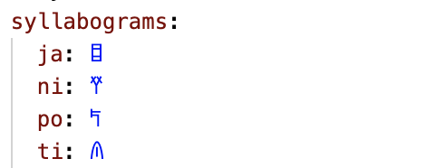
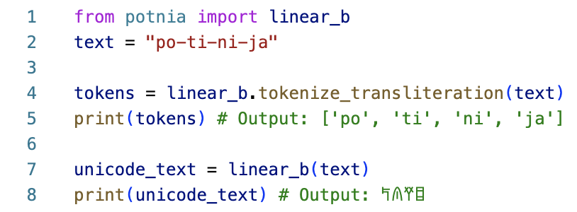
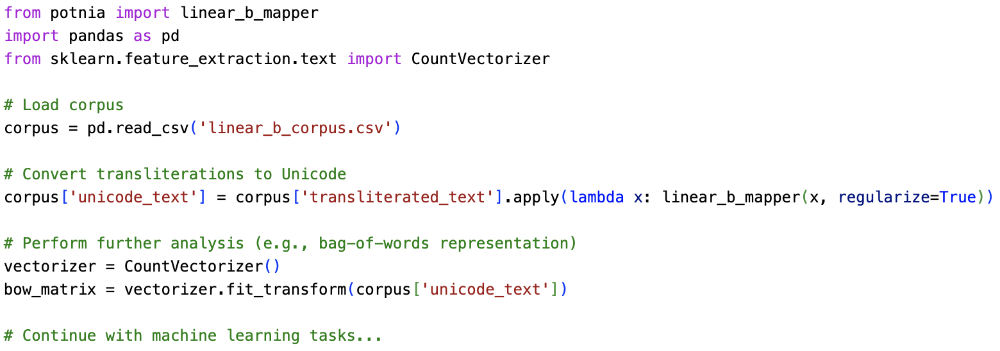

# Summary

Potnia is an open-source Python library designed to convert Romanized transliterations of ancient texts into their respective Unicode representations. Significant progress has been made in the digitization of ancient language corpora. However, many of these datasets are solely presented in transliterated form, even though the necessary Unicode blocks exist to render them using their native script. This restriction to using transliterated datasets for certain ancient scripts has the potential to limit the precision of linguistic analysis via machine learning.

Potnia bridges this gap by providing a flexible framework for converting transliterations into Unicode. By enabling tokenization and processing in the original script, Potnia can optimize tasks such as textual restoration and machine learning-based analysis. The library currently supports the conversion of Linear B texts, with future expansions planned for Linear A, Sumero-Akkadian cuneiform, Hittite cuneiform, Luwian hieroglyphs, and Etruscan. This tool can offer significant value to both computational linguistics and digital humanities, enabling researchers to work with ancient texts in their native script.

# Statement of Need

While machine learning has increasingly been applied to the study of ancient languages [@sommerschieldMachineLearningAncient2023], much of this progress has involved working with transliterated texts, rather than native script formats [@luoNeuralDeciphermentMinimumcost2019; @papavassileiouGenerativeModelMycenaean2023; @fetayaRestorationFragmentaryBabylonian2020; @peronocacciafocoNewApproachDecipherment2021]. Although Unicode standards exist for many ancient scripts, transliterated texts remain prevalent due to historical digitization practices.

Transliteration is the process of converting text from its original script into a different script, using systematic processes. It allows those who can understand the secondary script comprehend the orthography and the approximate pronunciation of the original text. Prior to the gradual introduction of relevant Unicode blocks since the 1990s [@Hossain2024], it was also usually necessary for representing non-Latin scripts on Western computational systems, which were largely confined to letters of the Latin alphabet and a small number of special characters.

Transliteration has an important place in aiding new learners of an ancient script to understand the pronunciation and orthography of the underlying language it represents (particularly for non-alphabetic scripts, where beginners need to grasp a vast repertoire of unfamiliar signs). However, it is well recognized that this process can only provide an approximate, and often unsatisfactory or disputed, representation of the original text [@weinbergTransliterationDocumentation1974; @odishoTransliteratingEnglishArabic1992; @martinetProjectTransliterationClassical1953]. In particular, a lack of standardized approaches to transliteration can introduce considerable ambiguity and noise into the dataset in a variety of ways, including:

  - the use of various notation systems, with different transliterations representing the exact same sign in distinct ways (e.g. where {height="11pt"} in Akkadian cuneiform can be represented as either 'mè' or 'me\textsubscript{3}');
  - changing opinions on particular sign values over time, introducing possible differences between older and newer transliterations (e.g. {height="11pt"} in the Linear B script changing from the previously suggested value of 'pa\textsubscript{2}' to 'qa')[@chadwickDocumentsMycenaeanGreek1973, pp. 391–92];
  - and the way in which transliteration obscures polyvalency in scripts, where a single sign can represent multiple different values (e.g. {height="11pt"} in Hittite cuneiform can represent three different syllables, transliterated as 'ḫar', 'ḫur' and 'mur', as well as acting as a logogram for three different words, 'ring', 'thick' and 'lung').

For language modelling tasks, we therefore suggest that representations of texts in their native form are preferable to achieve the most accurate results. A number of digitized corpora for well-resourced and widely studied ancient languages are now available in Unicode representations of their native script, including a corpus of ancient Greek [@canonicalgreek], classical Hebrew [@sefaria_project], Syriac [@digital_syriac] and Arabic [@openiti]. However, many other online text corpora remain restricted to Romanized translisterations (despite the availability of relevant Unicode standards), presumably due to considerations around ease, system limitations and accessibility, e.g. Linear B [@auroraDAMOSDatabaseMycenaean2015], Ugaritic [@prosser2019ras] and Sumero-Akkadian cuneiform [@cdli2024]. For this latter group of scripts, current tools capable of converting transliterated ancient texts to the corresponding Unicode appear limited to implementations of Cuneify [@tinney2019cuneify], which at present is only applicable to datasets in Sumero-Akkadian cuneiform.

In addition, such transliterations of ancient texts are often heavily annotated, with special characters used to denote a range of features including uncertain readings, missing or damaged elements, erasures, non-textual marks, and annotations by modern transliterators pertaining to structural or physical elements of the document. If not removed or handled appropriately, these have the potential to introduce further noise into language models. 

These are the primary gaps we have aimed to address through the development of Potnia. The library's focus on ancient languages and its extensible architecture make it a valuable asset for researchers working with digitized ancient corpora. It is also equipped to provide specific handling of these elements, with tailored tokenization and regularization rules pertaining to both script-specific and corpus-specific conventions. Potnia therefore enables a key pre-processing step in the language modelling pipeline, with the resulting Unicode outputs of ancient texts enabling more accurate and nuanced computational analysis of these texts in downstream modelling tasks.

# Implementation

Potnia is implemented in Python with an extensible architecture centered around the Mapper class, which converts transliterated texts into Unicode representations. and is designed to handle the complexities of ancient scripts through a flexible and customizable framework.

## Key Features


1. **YAML-Based Mapping Specification:**  Potnia stores script-specific syllabograms and logograms in YAML files, allowing easy updates and additions (fig. \ref{fig:syllabograms}). This approach ensures scalability when integrating new scripts like Linear A and Sumero-Akkadian cuneiform.

{ width=50% }

<!--
    ```yaml
    syllabograms:
      ja: 𐀊
      ni: 𐀛
      po: 𐀡
      ti: 𐀴
    ```
-->

2. **Regular Expressions for Complex Text:** Regular expressions are used to manage uncertain readings, special symbols, and compound tokens. This enables accurate tokenization and conversion of transliterated texts.

3. **Custom Tokenization and Unicode Conversion:** Potnia provides a flexible tokenization system tailored to each script’s unique structure. The ``to_unicode`` method converts transliterations into Unicode based on mappings stored in YAML files (fig. \ref{fig:potnia-example}).

{ width=80% }

4. **Regularisation of Text:** The regularize method cleans the output by handling missing elements and unnecessary tags, refining the text for downstream use.

<!--
    ```python
    from potnia import linear_b_mapper
    text = "po-ti-ni-ja"

    # Tokenisation Example
    tokens = linear_b_mapper.tokenize_transliteration(text)
    print(tokens)  # Output: ['po', 'ti', 'ni', 'ja']

    # Unicode Mapping
    unicode_text = linear_b_mapper(text)
    print(unicode_text)  # Output: 𐀡𐀴𐀛𐀊
    ```
    -->
5. **Comprehensive Testing:** Pytest fixtures allow us to define test cases as lines in YAML files which allowed us to consisely add over almost 300 test examples, covering a broad range of edge cases. The code coverage of the tests is 100%.
<!-- Test cases, defined in YAML files, cover various scripts like Linear B and Linear A, ensure acc

    ```python
    @pytest.mark.parametrize("test_input,expected", expected("linear_b_unicode_regularized"))
    def test_linear_b_unicode_regularized(test_input, expected):
        result = linear_b_mapper(test_input, regularize=True)
        assert result == expected
    ```
This design makes Potnia easily extendable, with Linear B fully supported and work underway for other scripts like Linear A and Akkadian. -->

6. **Versatile Interface Options** Users can interact with Potnia as a Python library, or through the command line interface (CLI) or through the graphical user interface (GUI).


# Research Application

Potnia’s design and functionality address the following challenges in the analysis of ancient texts:

1. **Extensibility:** Potnia is designed to be highly extensible, allowing researchers to integrate new scripts by defining script-specific rules for tokenization and conversion. This flexibility makes the library suitable for a wide range of ancient languages that are not yet represented in Unicode, providing a valuable tool for researchers across various fields of ancient studies.

2. **Integration with Research Workflows:** Researchers can easily incorporate Potnia into their existing workflows. For example, in a typical research scenario, Potnia could be used to preprocess a corpus of Linear B texts before feeding them into a machine learning model for further analysis.

<!-- 
{ width=100% }
-->

<!-- 
    ```python
    from potnia import linear_b_mapper
    import pandas as pd
    from sklearn.feature_extraction.text import CountVectorizer

    # Load corpus
    corpus = pd.read_csv('linear_b_corpus.csv')

    # Convert transliterations to Unicode
    corpus['unicode_text'] = corpus['transliterated_text'].apply(lambda x: linear_b_mapper(x, regularize=True))

    # Perform further analysis (e.g., bag-of-words representation)
    vectorizer = CountVectorizer()
    bow_matrix = vectorizer.fit_transform(corpus['unicode_text'])

    # Continue with machine learning tasks...
    ```
-->

Potnia’s functionality is being used as part of a larger project aimed at deciphering the Linear A script. We are using Potnia to convert Romanized transliterations of Linear B tablets into Unicode datasets, and will extend this capability to Linear A. The resulting datasets will be used to train language-specific models for tasks such as text generation and masked language modeling. Future models developed using this library will be released for public use, supporting downstream tasks such as decipherment, textual restoration, and palaeographic analysis. 

# Availability

Potnia is open-source software released under the Apache 2.0 license. It is available through [PyPI](https://pypi.org/project/potnia/) and [GitHub](https://github.com/AncientNLP/potnia). We welcome contributions from the community and adhere to the Contributor Covenant Code of Conduct. Documentation is available at [https://ancientnlp.github.io/potnia/](https://ancientnlp.github.io/potnia/).


<!-- 
# Citations

Citations to entries in paper.bib should be in
[rMarkdown](http://rmarkdown.rstudio.com/authoring_bibliographies_and_citations.html)
format.

If you want to cite a software repository URL (e.g. something on GitHub without a preferred
citation) then you can do it with the example BibTeX entry below for @fidgit.

For a quick reference, the following citation commands can be used:
- `@author:2001`  ->  "Author et al. (2001)"
- `[@author:2001]` -> "(Author et al., 2001)"
- `[@author1:2001; @author2:2001]` -> "(Author1 et al., 2001; Author2 et al., 2002)"

# Figures

Figures can be included like this:

and referenced from text using \autoref{fig:example}.

Figure sizes can be customized by adding an optional second parameter:
{ width=20% } -->

# Acknowledgements

We acknowledge support from Brent Davis, Kim Doyle, Man-Hua (Kate) Chu, Anhui (Ellie) Situ and Stavroula (Stephie) Nikoloudis. This research was supported by The University of Melbourne’s Research Computing Services.


# References
